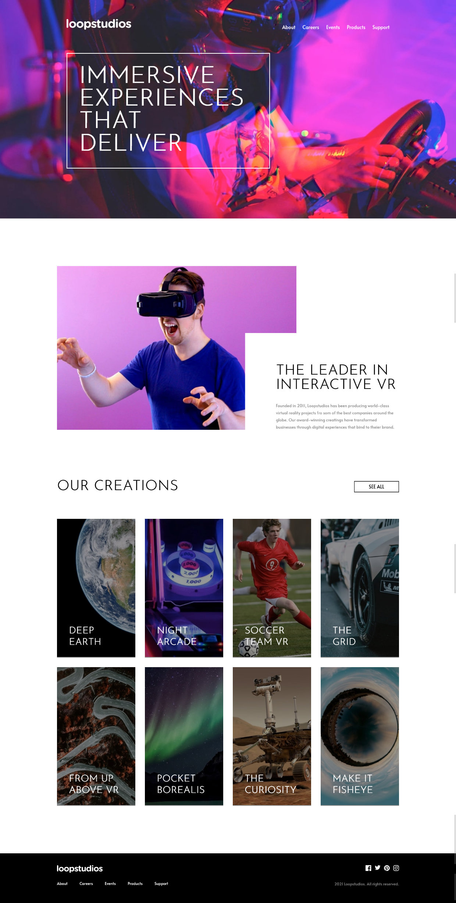

# Frontend Mentor - Loopstudios landing page solution

This is a solution to the [Loopstudios landing page challenge on Frontend Mentor](https://www.frontendmentor.io/challenges/loopstudios-landing-page-N88J5Onjw). Frontend Mentor challenges help you improve your coding skills by building realistic projects.

## Table of contents

-   [Overview](#overview)
    -   [The challenge](#the-challenge)
    -   [Screenshot](#screenshot)
    -   [Links](#links)
-   [My process](#my-process)
    -   [Built with](#built-with)
    -   [What I learned](#what-i-learned)
    -   [Continued development](#continued-development)
-   [Author](#author)

**Note: Delete this note and update the table of contents based on what sections you keep.**

## Overview

### The challenge

Users should be able to:

-   View the optimal layout for the site depending on their device's screen size
-   See hover states for all interactive elements on the page

### Screenshot

### Links

-   Solution URL: [Solution URL (Github)](https://github.com/svki-dev/loopstudios-lp-main)
-   Live Site URL: [live site URL](https://sven-kilcher-dev-loopstudios-lp-main.netlify.app/)

## My process

### Built with

-   Semantic HTML5 markup
-   CSS custom properties
-   Flexbox
-   CSS Grid
-   Javascript

### What I learned

For this simple landing page I tested PostCSS and additionally used a script to test lazy loading for images. Furthermore I worked with Vite for the first time.

### Continued development

I will continue to work with Vite and test PostCSS even more. Also the integrations that are available. Further I want to work more with Javascript in the next project.

## Author

-   Website - [Sven Kilcher](https://info@sven-kilcher.dev)
-   Frontend Mentor - [@WP-HH](https://www.frontendmentor.io/profile/WP-HH)
-   Github - [@svki-dev](https://github.com/svki-dev)
